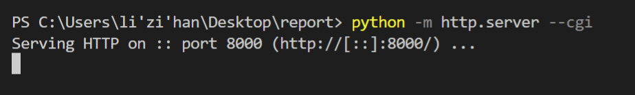
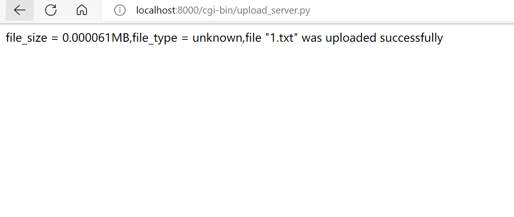
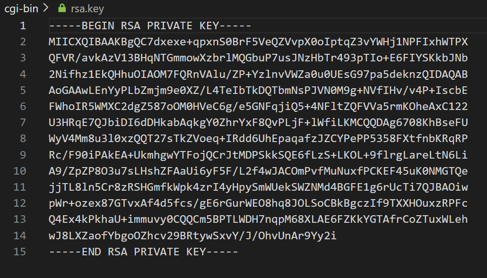
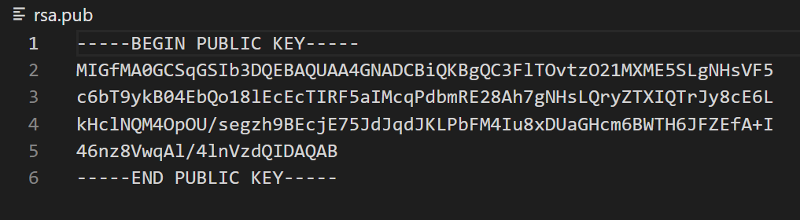
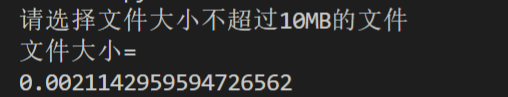
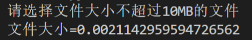

# 实验内容

### 一、文件上传网页前端的搭建

#### 1.body部分

    

	

		

			<h1><a href="index.html">用户注册页面</a></h1>
		

		

			<form enctype="multipart/form-data" method="post" action="http://localhost:8000/cgi-bin/upload_server.py"> 
			<table>
				<tr>
					<td>请填写用户名：</td>
					<td><input type="text" name="username"/></td>
				</tr>
				<tr>
					<td>请简单介绍该文件：</td>
					<td><textarea name="fileintro" rows="10" cols="50"></textarea></td>
				</tr>  
				<tr>
					<td>请选择你要上传的文件：</td>
					<td><input type="file" name="uploadfile"/></td>
				</tr>  
				<tr>
					<td><input type="submit" value="上传文件"/></td>
				</tr>
			</table>
		

	

	

#### 2.环境渲染部分

设置背景图片

    .background{
			height: 700px;
			width: 1280px;
			background: url(background.jpg);

文本框的渲染

    .system input[type="text"]{
		height: 30px;
		width: 165px;
		background-color:rgba(255,255,255,0.4);
		border: 1px solid #000000;
	    }
	.system textarea{
		background-color:rgba(255,255,255,0.4);
		border: 1px solid #000000;
	    }

提交按钮的渲染

    .system input[type="submit"]
	{
		height: 50px;
		width: 100px;
		background-color: #ffffff;
		border:3px solid #ffffff;
		font-size:16px; 
	}

### 二、文件上传及加密、数字签名

这里我的工作主要是完成文件上传的编码，并将米佳怡同学完成的加密、数字签名修改，与我的文件上传相适应。

#### 1.文件上传的主体部分

    import cgi,os
    from email import message
    import cgitb

    cgitb.enable()
    form = cgi.FieldStorage() 
    fileitem = form['uploadfile']

    if fileitem.filename:
        fn = os.path.basename(fileitem.filename)
        open(os.getcwd()+'/files/'+fn,'wb').write(fileitem.file.read())
        message = '"' + fn + '" was uploaded successfully'

    else:
        message = 'No file was uploaded'

#### 2.限制文件大小在10M以内

限制文件大小

    fsize = os.path.getsize(fn)

单位换算为MB

    fsize = fsize / float(1024*1024)

当文件大小大于10M时，重复以上操作

    while fsize > 10:
      print("选择的文件大于10MB请重新选择")
      cgitb.enable()
      form = cgi.FieldStorage()
      fileitem = form['uploadfile']
      fsize = os.path.getsize(fn) 
      fsize = fsize / float(1024*1024)

#### 3.限制文件类型

1.定义不同文件类型

    def typeList():
        return {
        "3c68313ee689abe68f8f": 'html',
        "504b03040a0000000000": 'xlsx',
        '504b0304140008080800': 'docx',
        "d0cf11e0a1b11ae10000": 'doc',
        '2d2d204d7953514c2064': 'sql',
        'ffd8ffe000104a464946': 'jpg',
        '89504e470d0a1a0a0000': 'png',
        '47494638396126026f01': 'gif',
        '3c21444f435459504520': 'html',
        '3c21646f637479706520': 'htm',
        '48544d4c207b0d0a0942': 'css',
        '2f2a21206a5175657279': 'js',
        '255044462d312e350d0a': 'pdf',
        }

2.字节码转16进制字符串

    def bytes2hex(bytes):
      num = len(bytes)
      hexstr = u""
      for i in range(num):
        t = u"%x" % bytes[i]
        if len(t) % 2:
            hexstr += u"0"
        hexstr += t
      return hexstr.upper()

3.获取文件类型

    def filetype(fileitem):
      binfile = open(fileitem, 'rb')  # 必需二制字读取
      bins = binfile.read(20)  # 提取20个字符
      binfile.close()  # 关闭文件流
      bins = bytes2hex(bins)  # 转码
      bins = bins.lower()  # 小写
      print(bins)
      tl = typeList()  # 文件类型
      ftype = 'unknown'
      for hcode in tl.keys():
        lens = len(hcode)  # 需要的长度
        if bins[0:lens] == hcode:
            ftype = tl[hcode]
            break
      if ftype == 'unknown':  # 全码未找到，优化处理，码表取5位验证
        bins = bins[0:5]
      for hcode in tl.keys():
        if len(hcode) > 5 and bins == hcode[0:5]:
            ftype = tl[hcode]
            break
      return ftype

4.文件扫描，如果是目录，就将遍历文件，是文件就判断文件类型

    def filescanner(path):# 文件扫描，如果是目录，就将遍历文件，是文件就判断文件类型
      if type(path) != type('a'):  # 判断是否为字符串
        print('抱歉，你输入的不是一个字符串路径！')
      elif path.strip() == '':  # 将两头的空格移除
        print('输入的路径为空！')
      elif not os.path.exists(path):
        print('输入的路径不存在！')
      elif os.path.isfile(path):
        if path.rfind('.') > 0:
            print('文件名:', os.path.split(path)[1])
        else:
            print('文件名中没有找到格式')
        path = filetype(path)
        if (path == 'png' or path == 'jpg' or path == 'doc' or path == 'docx'):
            print("文件类型不符合请重新选择")
        else:
            print('解析文件判断格式：' + path)
      elif os.path.isdir(path):
        print('输入的路径指向的是目录，开始遍历文件')
        for p, d, fs in os.walk(path):
            print(os.path.split(p))
            for n in fs:
                n = n.split('.')
                print('\t' + n[0] + '\t' + n[1])

5.主函数，调用之前定义的函数

    if __name__ == '__main__':
      fn = os.path.basename(fileitem.filename)
      ftype = filetype(fn)

#### 4.输出文件是否上传成功的message

    open(os.getcwd()+'/files/'+fn,'wb').write(fileitem.file.read())
    message = '"' + fn + '" was uploaded successfully'
    
    else:
    message = 'No file was uploaded'

#### 5.数字签名

创建RSA密钥步骤说明：

1、从 Crypto.PublicKey 包中导入 RSA，创建一个密码

2、生成 1024/2048 位的 RSA 密钥

3、调用 RSA 密钥实例的 exportKey 方法，传入密码、使用的 PKCS 标准以及加密方案这三个参数。

4、将私钥写入磁盘的文件。

5、使用方法链调用 publickey 和 exportKey 方法生成公钥，写入磁盘上的文件。

生成随机数

    random_gen = Random.new().read# 伪随机数生成器
    rsa = RSA.generate(1024, random_gen)# 生成秘钥对实例对象：1024是秘钥的长度

Server的秘钥对的生成

    private_pem = rsa.exportKey()
    with open("server_private.pem", "wb") as f:
        f.write(private_pem)

    public_pem = rsa.publickey().exportKey()
    with open("server_public.pem", "wb") as f:
        f.write(public_pem)

Client的秘钥对的生成

    private_pem = rsa.exportKey()
    with open("client_private.pem", "wb") as f:
        f.write(private_pem)

    public_pem = rsa.publickey().exportKey()
    with open("client_public.pem", "wb") as f:
        f.write(public_pem)

Server使用自己的私钥对内容进行签名

:param data: 明文数据

:return: 签名后的字符串sign

    def signature(self,data:str):
        # 读取私钥
        private_key = RSA.import_key(open("server_private.pem").read())
        # 根据SHA256算法处理签名内容data
        sha_data= SHA256.new(data.encode("utf-8")) # b类型

        # 私钥进行签名
        signer = Signature_PKC.new(private_key)
        sign = signer.sign(sha_data)

        # 将签名后的内容，转换为base64编码
        sign_base64 = base64.b64encode(sign)
        return sign_base64.decode()

Client使用Server的公钥对内容进行验签

:param data: 明文数据,签名之前的数据

:param signature: 接收到的sign签名

:return: 验签结果,布尔值

    def verify(self,data:str,signature:str) -> bool:
        # 接收到的sign签名 base64解码
        sign_data = base64.b64decode(signature.encode("utf-8"))

        # 加载公钥
        piblic_key = RSA.importKey(open("server_public.pem").read())

        # 根据SHA256算法处理签名之前内容data
        sha_data = SHA256.new(data.encode("utf-8"))  # b类型

        # 验证签名
        signer = Signature_PKC.new(piblic_key)
        is_verify = signer.verify(sha_data, sign_data)

        return is_verify

主函数：

    if __name__ == '__main__':

    mrsa = HandleRSA()
    # mrsa.create_rsa_key()
    cgitb.enable()
    form = cgi.FieldStorage() # 获取网页提交的数据
    fileitem = form['uploadfile']

    # 一次性读取文本内容
    with open(fileitem, 'r', encoding='utf-8') as banks:
    # print(text) 测试打印读取的数据
    # 待加密文本
        mystr = banks.read()
        message = base64.b64encode(mystr.encode('utf-8')).decode('ascii')

    sign_data = mrsa.signature(message)
    is_verify = mrsa.verify(data=message,signature=sign_data)
    print("签名：\n",sign_data)
    print("验签：\n",is_verify)

#### 6.输出

    print('Content-type:text/html \n\n')
    print('file_size = %fMB,file_type = %s,file %s' % (fsize,ftype,message))

# 实验结果

#### 1.建立HTTP连接

    python -m http.server --cgi

#### 2.输入网址

输入网址，查看输出是否正常

    http://localhost:8000/upload.html

网页页面

选择需要上传的文件

得到文件大小、文件类型，及文件上传成功的语句

密钥的生成

# 实验问题及解决

### 1、print输出的换行问题

代码改为：

print('文件大小=',end='')

print(fsize)

可以做到输出不换行

修改前：

修改后：

### 2、获取html表单提交数据的地址问题

为了获取文件大小，从而限制文件在10M以内，应该获取表单上传文件的地址。

刚开始，我试了很多种方法获取html表单上传文件的地址，但这与获取本地文件大小的方法不同。

最后，解决方法为：

    fn = os.path.basename(fileitem.filename)

### 3、在制作前端网页的背景问题

在制作前端网页时，想要将背景替换掉，在csdn上查询之后获得解决方法。

解决方法为：
 
    background: url(background.jpg)

使用url()，将背景设置为本地图片。

### 4、Crypto库

运行程序之后报错：No module named “Crypto”

但当pip install Crypto后仍提示：No module named “Crypto”，解决方案如下：

    pip uninstall crypto pycryptodome
    pip install pycryptodome

pycrypto和crypto是同一个库，crypto在 python 中又被称为pycrypto，它是一个第三方库，但是已经停止更新了。pycryptodome是crypto的延伸版本，用法和crypto一样，可以完全替代crypto。

# 参考文献

https://edu.csdn.net/skill/python/python-3-136?category=7&typeId=17454

https://www.runoob.com/python/python-cgi.html

https://blog.csdn.net/qq_45927266/article/details/120223355

https://blog.csdn.net/weixin_41298678/article/details/103136768#:~:text=%E5%9C%A8%E7%BB%88%E7%AB%AF%EF%BC%8C%E8%BF%9B%E5%85%A5www%E7%9B%AE%E5%BD%95%EF%BC%8C%E8%BE%93%E5%85%A5python%20-m%20http.server,--cgi%20%EF%BC%8C%E5%90%AF%E5%8A%A8%E6%9C%8D%E5%8A%A1%20%E6%89%93%E5%BC%80%E7%BD%91%E9%A1%B5%EF%BC%8C%E8%BE%93%E5%85%A5http%3A%2F%2Flocalhost%3A8000%2Findex.html%205%E3%80%81%E7%82%B9%E5%87%BB%E9%80%89%E6%8B%A9%E6%96%87%E4%BB%B6%EF%BC%8C%E5%9C%A8%E6%9C%AC%E5%9C%B0%E9%80%89%E6%8B%A9%E6%96%87%E4%BB%B6%EF%BC%8C%E7%82%B9%E5%87%BBsubmit%E4%B8%8A%E4%BC%A0%E6%96%87%E4%BB%B6%E5%8D%B3%E5%8F%AF%E3%80%82