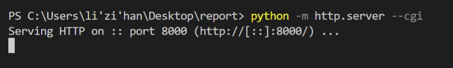
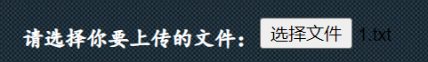
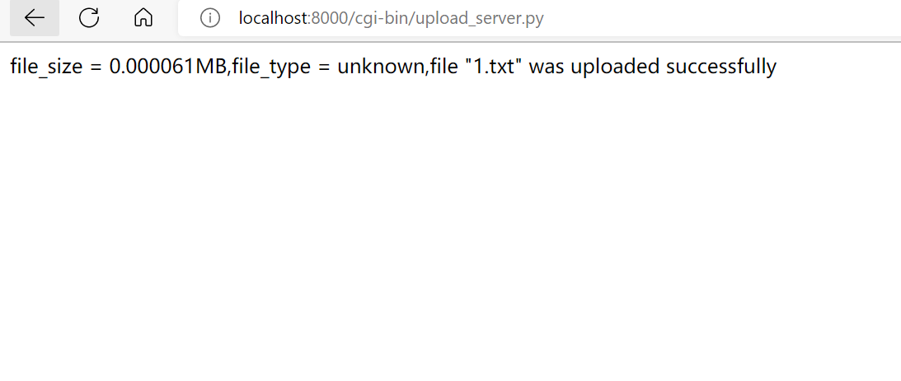

# 个人在本次大作业中的主要贡献

我的工作主要是：

1.搭建文件上传前后端的框架

2.完成文件上传的编码

3.将米佳怡同学完成的加密、数字签名修改，并添加到文件上传代码的框架中。

4.将上传本地文件的代码调试为上传表单选中文件的代码，与文件上传代码相适应。

# 完成了哪些自认为有技术含量的工作

### 一、文件上传网页前端的搭建

#### 1.body部分

    

	

		

			<h1><a href="index.html">用户注册页面</a></h1>
		

		

			<form enctype="multipart/form-data" method="post" action="http://localhost:8000/cgi-bin/upload_server.py"> 
			<table>
				<tr>
					<td>请填写用户名：</td>
					<td><input type="text" name="username"/></td>
				</tr>
				<tr>
					<td>请简单介绍该文件：</td>
					<td><textarea name="fileintro" rows="10" cols="50"></textarea></td>
				</tr>  
				<tr>
					<td>请选择你要上传的文件：</td>
					<td><input type="file" name="uploadfile"/></td>
				</tr>  
				<tr>
					<td><input type="submit" value="上传文件"/></td>
				</tr>
			</table>
		

	

	

#### 2.环境渲染部分

设置背景图片

    .background{
			height: 700px;
			width: 1280px;
			background: url(background.jpg);

文本框的渲染

    .system input[type="text"]{
		height: 30px;
		width: 165px;
		background-color:rgba(255,255,255,0.4);
		border: 1px solid #000000;
	    }
	.system textarea{
		background-color:rgba(255,255,255,0.4);
		border: 1px solid #000000;
	    }

提交按钮的渲染

    .system input[type="submit"]
	{
		height: 50px;
		width: 100px;
		background-color: #ffffff;
		border:3px solid #ffffff;
		font-size:16px; 
	}

### 二、文件上传及加密、数字签名

这里我的工作主要是搭建文件上传前后端的框架，完成文件上传的编码，并将米佳怡同学完成的加密、数字签名修改，与文件上传编码相适应。

#### 1.文件上传的主体部分

    import cgi,os
    from email import message
    import cgitb

    cgitb.enable()
    form = cgi.FieldStorage() 
    fileitem = form['uploadfile']

    if fileitem.filename:
        fn = os.path.basename(fileitem.filename)
        open(os.getcwd()+'/files/'+fn,'wb').write(fileitem.file.read())
        message = '"' + fn + '" was uploaded successfully'

    else:
        message = 'No file was uploaded'

#### 2.输出文件是否上传成功的message

    open(os.getcwd()+'/files/'+fn,'wb').write(fileitem.file.read())
    message = '"' + fn + '" was uploaded successfully'
    
    else:
    message = 'No file was uploaded'

#### 3.网页前端输出语句

    print('Content-type:text/html \n\n')
    print('file_size = %fMB,file_type = %s,file %s' % (fsize,ftype,message))

#### 4.网页预览

建立HTTP连接

    python -m http.server --cgi

输入网址，查看输出是否正常

    http://localhost:8000/upload.html

网页页面

选择需要上传的文件

得到文件大小、文件类型，及文件上传成功的语句

# 实验问题及解决

### 1、print输出的换行问题

代码改为：

print('文件大小=',end='')

print(fsize)

可以做到输出不换行

修改前：

修改后：

### 2、获取html表单提交数据的地址问题

为了获取文件大小，从而限制文件在10M以内，应该获取表单上传文件的地址。

刚开始，我试了很多种方法获取html表单上传文件的地址，但这与获取本地文件大小的方法不同。

最后，解决方法为：

    fn = os.path.basename(fileitem.filename)

### 3、在制作前端网页的背景问题

在制作前端网页时，想要将背景替换掉，在csdn上查询之后获得解决方法。

解决方法为：
 
    background: url(background.jpg)

使用url()，将背景设置为本地图片。

### 4、Crypto库

运行程序之后报错：No module named “Crypto”

但当pip install Crypto后仍提示：No module named “Crypto”，解决方案如下：

    pip uninstall crypto pycryptodome
    pip install pycryptodome

pycrypto和crypto是同一个库，crypto在 python 中又被称为pycrypto，它是一个第三方库，但是已经停止更新了。pycryptodome是crypto的延伸版本，用法和crypto一样，可以完全替代crypto。

# 参考文献

https://edu.csdn.net/skill/python/python-3-136?category=7&typeId=17454

https://www.runoob.com/python/python-cgi.html

https://blog.csdn.net/qq_45927266/article/details/120223355

https://blog.csdn.net/weixin_41298678/article/details/103136768#:~:text=%E5%9C%A8%E7%BB%88%E7%AB%AF%EF%BC%8C%E8%BF%9B%E5%85%A5www%E7%9B%AE%E5%BD%95%EF%BC%8C%E8%BE%93%E5%85%A5python%20-m%20http.server,--cgi%20%EF%BC%8C%E5%90%AF%E5%8A%A8%E6%9C%8D%E5%8A%A1%20%E6%89%93%E5%BC%80%E7%BD%91%E9%A1%B5%EF%BC%8C%E8%BE%93%E5%85%A5http%3A%2F%2Flocalhost%3A8000%2Findex.html%205%E3%80%81%E7%82%B9%E5%87%BB%E9%80%89%E6%8B%A9%E6%96%87%E4%BB%B6%EF%BC%8C%E5%9C%A8%E6%9C%AC%E5%9C%B0%E9%80%89%E6%8B%A9%E6%96%87%E4%BB%B6%EF%BC%8C%E7%82%B9%E5%87%BBsubmit%E4%B8%8A%E4%BC%A0%E6%96%87%E4%BB%B6%E5%8D%B3%E5%8F%AF%E3%80%82