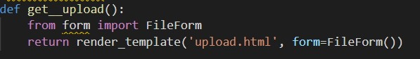
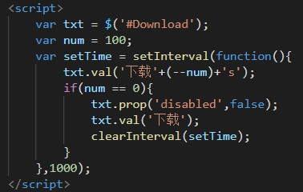

# 中传放心传

文件的上传与下载部分。

## 实验功能清单

- 基于网页的文件上传加密与数字签名系统
  - 已完成《基于网页的用户注册与登录系统》所有要求
  - 限制文件大小：小于 10MB
  - 限制文件类型：office文档、常见图片类型
  - 匿名用户禁止上传文件
  - 对文件进行对称加密存储到文件系统，禁止明文存储文件【*对称加密* *密钥管理（如何安全存储对称加密密钥）* *对称加密密文的PADDING问题* 】
  - 系统对加密后文件进行数字签名【*数字签名（多种签名工作模式差异）* 】
  - 文件秒传：服务器上已有的文件，客户端可以不必再重复上传了
- 基于网页的加密文件下载与解密
  - 已完成《基于网页的文件上传加密与数字签名系统》所有要求
  - 提供匿名用户加密后文件和关联的数字签名文件的下载
    - 客户端对下载后的文件进行数字签名验证【*非对称（公钥）加密* *数字签名* 】
    - 客户端对下载后的文件可以解密还原到原始文件【*对称解密* *密钥管理* 】
  - 提供已登录用户解密后文件下载
  - 下载URL设置有效期（限制时间或限制下载次数），过期后禁止访问【*数字签名* *消息认证码* *Hash Extension Length Attack* *Hash算法与HMAC算法的区别与联系* 】
  - 提供静态文件的散列值下载，供下载文件完成后本地校验文件完整性【*散列算法* 】

## 实验内容

功能清单中部分实现较为简单，其余功能代码思路如下。

|                           代码思路                           |                           完成功能                           |
| :----------------------------------------------------------: | :----------------------------------------------------------: |
|                   判断文件大小是否大于10M                    |                         限制文件大小                         |
|                     验证当前用户是否登录                     |                     匿名用户禁止上传文件                     |
|          使用网站私钥解密所得对称密钥加密上传的文件          |                       禁止明文储存文件                       |
|            在已上传文件中检索是否存在当前上传文件            |                           文件秒传                           |
| 检索并定位至所求文件，从服务器端获取加密文件及对称密钥，解密得到明文 |          提供匿名用户加密后文件及其数字签名文件下载          |
|                        增加倒计时效果                        |                        过期后禁止访问                        |
|                     计算文件散列值并上传                     | 提供静态文件的散列值下载，供下载文件完成后本地校验文件完整性 |

## 实验问题与解决

- 问题1：示例demo始终无法运行，还在下载docker过程中操作不慎导致频繁报错危害电脑；

  在反复观看视频与求助老师同学后彻底删除重新配置环境，通过下载wsl插件并使用win10自带Hyper-v虚拟机等方式，了解了“容器”方式，最终成功运行出网页界面。

- 问题2：前后端对接不流畅，前端输入数据表单不知如何发送至后端；

  - 在html文件中使用action语法，规定提交时表单发向何处；

    

  - 在py文件中使用return render，(request, 'hello.html')

    > return render：组合指定的HTML模板和一些要插入到模板中的数据（在名为“context”的变量中提供）来创建HTML文件，是一个使用render函数的快捷方式。

    

- 问题3：URL设置有限期

  本想使用change()函数进行事件触发设置，即时间结束链接自动失效，后发现change()多表现在表单事件，如下拉选择框、input对话框等，在用户做出选择或做出改变时触发change事件，与思路中的倒计时设置较为不同，于是更改为通过下载按钮失效与否进行。用户进入到本页面时自动开始倒计时，倒计时结束后超链接失效，无法下载文件。
  
  

## 参考资料

- [前端后端交互](https://blog.csdn.net/thzhaopan/article/details/123513504)
- [change()函数使用](https://www.w3school.com.cn/jquery/event_change.asp)
- [倒计时效果](https://blog.csdn.net/qq_42363032/article/details/89212347?ops_request_misc=&request_id=&biz_id=102&utm_term=change%E4%BA%8B%E4%BB%B6%20%E5%80%92%E8%AE%A1%E6%97%B6&utm_medium=distribute.pc_search_result.none-task-blog-2~all~sobaiduweb~default-1-89212347.142^v40^pc_rank_34_queryrelevant25,185^v2^control&spm=1018.2226.3001.4187)