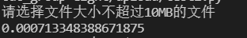
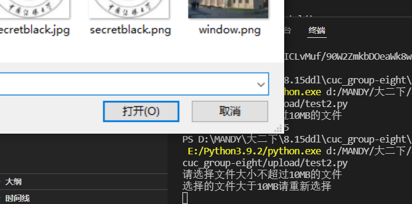
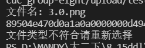
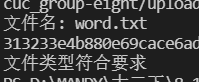
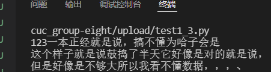
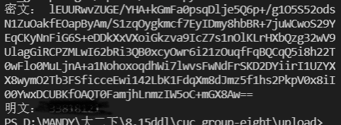
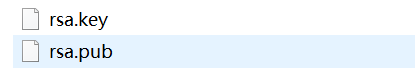
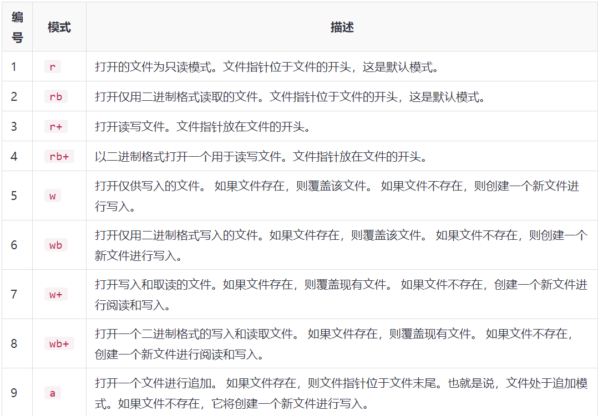

## README

#### 主要完成的内容：基于网页的文件上传加密与数字签名系统

##### 匿名用户禁止上传文件

在本地实现上传所需要求的基本代码编写

- 限制文件大小：小于10MB  (filesize.py)
  
  
- 限制文件类型：office文档、常见图片类型 (filechoose.py)
  
  
- 利用AES对文件进行对称加解密 (AES.py)
  加密后存储的密文如图
  
  解密后还原原始明文
  
  利用RSA加密算法对密钥进行加密，用公开公钥进行加密，对方用私钥进行解密，以确保密钥的安全 (RSA.py)
  

- 对加密后的文件进行数字签名，仍然选择使用RSA加密的方式进行数字签名。用自身生成的私钥进行签名然后另一方使用上传方公开的公钥即可进行验证。
  

- 将上述代码进行整合得到 upload.py
  

#### 遇到过的一些问题

- 限制文件类型
  一开始进行查找中寻找到第三方库 'filetype' ，发现其可以利用提供文件扩展名和 [MIME 类型](https://blog.csdn.net/for_cxc/article/details/116210252?utm_medium=distribute.pc_relevant.none-task-blog-2~default~baidujs_baidulandingword~default-1-116210252-blog-73824760.pc_relevant_aa&spm=1001.2101.3001.4242.2&utm_relevant_index=4)判断,但是在本地进行编码调试后发现，在本地对图片类型如：jpg,png等可以正常运行，但是涉及到office文档，比如：doc，docx等均会出现报错。

  查询后发现该方法的支持类型有限，[支持类型](https://blog.csdn.net/weixin_34206899/article/details/85971196?utm_medium=distribute.pc_relevant.none-task-blog-2~default~baidujs_title~default-4-85971196-blog-102943059.pc_relevant_aa&spm=1001.2101.3001.4242.3&utm_relevant_index=7) 与我们应用的需求不符，所以要更换方法。

  再进一步查询后选择通过文件头判断文件类型

  在进行限制文件类型的编码时，根据网上查询的相关代码进行实验，结果发现对于 'EXT_RAR' 会产生报错，显示 'EXT_RAR is not defined' 然后进行相关查找

  查看python原生的文件操作 [链接](https://www.yiibai.com/python/python_files_io.html)
  以下是打开文件使用的模式的列表：
  
  
  
  所以按照一开始借鉴的验证文件格式的源码，要读到二进制，且只提取文件头指定个数的字节码，利用 'read()' 函数做到，传递参数 'count' 是从打开的文件读取的字节数。 该方法从文件的开始位置开始读取，如果count不指定值或丢失，则尽可能地尝试读取文件，直到文件结束。由于不可能手动输入所有的文件类型的文件头，所以只记录其中需要进行限制的文件类型用于判断即可。

- 文件加密
  首先借鉴一个自行编码实现DES的加密算法，经调试后可在主机上正常运行，但是代码整体太庞大，转而想寻找第三方库代替

  经寻找借鉴后选择 PyCryptodome 库, 首先通过 
  > pip install pycryptodomex

  进行安装。
  
  准备通过该库实现AES加密，在修改过后，可以完成简单的加解密。然后尝试将文件进行替换。
  首先先想办法将文件转化为字符串[借鉴](https://www.zhihu.com/question/513497384)发生报错：
  >'gbk' codec can't decode byte 0x80 in position 5: illegal multibyte sequence
  
  查找修改方式后发现可能存在两种原因：1.utf-8编码 2.gdk编码
  然后将读取方式改为
  >with open(filename, 'r', encoding='utf-8') as  banks:
        # print(text) 测试打印读取的加密数据
        # 待解密文本
        text = banks.read()

  代码可正常使用

- 非对称加密的产生公私钥的加密
  将RSA算法中的公私钥保存到本地时，发生报错
  > write() argument must be str, not bytes

  原始使用的写入方式是：
  > with open('rsa.key', 'w') as f:
    f.write(private_pem)

  搜索发现是UTF-8编码问题。UTF-8（8-bit Unicode Transformation Format）是一种针对Unicode的可变长度字符编码，共有8个二进制位。程序中如果直接f.write()则不会出错，但是因为其是unicode编码，所以文件会出错，全是乱码。
  解决办法：使用二进制写入模式 'wb' 来开启操作文件
  即改为：
  with open('rsa.key', 'wb') as f:
    f.write(private_pem)
  

  
